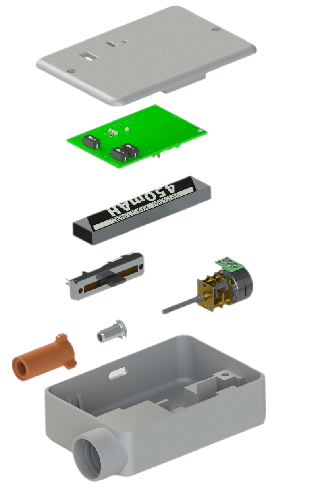

# Ultra Low-Cost Insulin Pump

This Git repository represents the final result of multiple design iterations of a low-cost insulin pump I have designed as part of my studies in medical device development. The repository contains files for hardware, both electrical and mechanical, and firmware. I have also included a BOM to make ordering of components easier if anyone wishes to replicate this design. The device has been tested in humans, in a small clinical trial, and a write-up of the results was published [here](https://pmc.ncbi.nlm.nih.gov/articles/PMC11292867/).

## Overview

The files for this device are split into four main areas: electrical hardware, mechanical hardware, android application, and firmware. This README contains a subsection for each of these aspects, including build instructions, initial setup, and usage. A complete exploded assembly for the device is shown in the image below:

 

### Electrical Hardware
PCB schematics and layout were created in KiCad, so you will need to install this to view/edit/order some assemblies. KiCad can be downloaded [here](https://www.kicad.org/download/). I added some components by hand to reduce costs; however I acknowledge not everyone would be comfortable to do so. Therefore, I'll be uploading an EasyEDA file soon which can be uploaded to JLCPCB, and allow you to order an assembled board more easily. Expect the total cost of an assembled board to be around US$30.

This PCB utilises an ESP32-S3 SOC as its MCU, and delivers the following functionality for the low-cost pump:

1. Wireless communication via BLE
2. Stepper motor control thorugh interface with DRV8846
3. Li-Po charging through interface with MCP78371 through USB C 2.0
4. ADC monitoring of battery level 
5. ADC monitoring of linear potentiometer to determine position.
   

